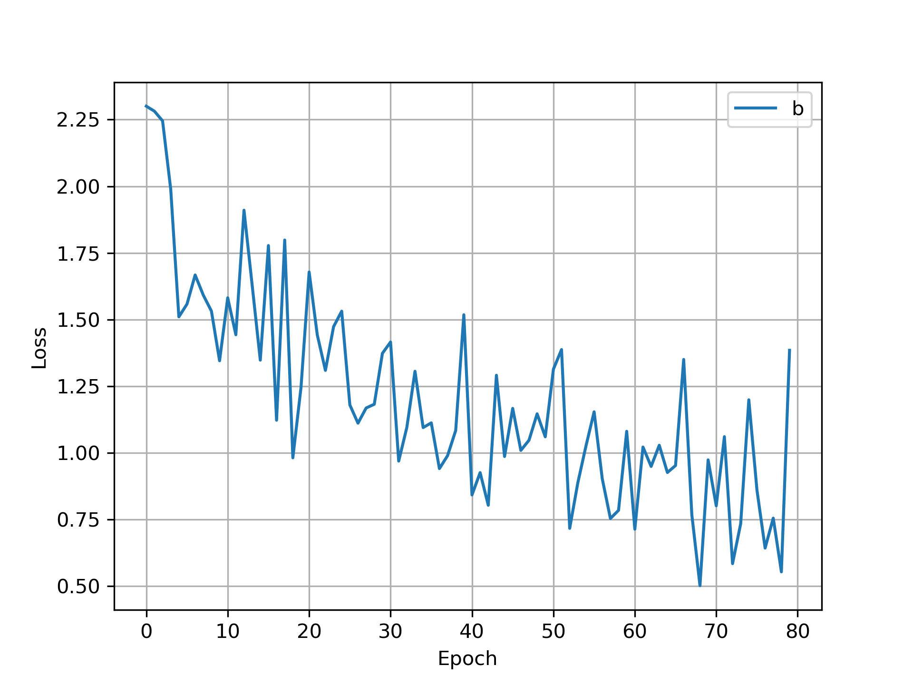
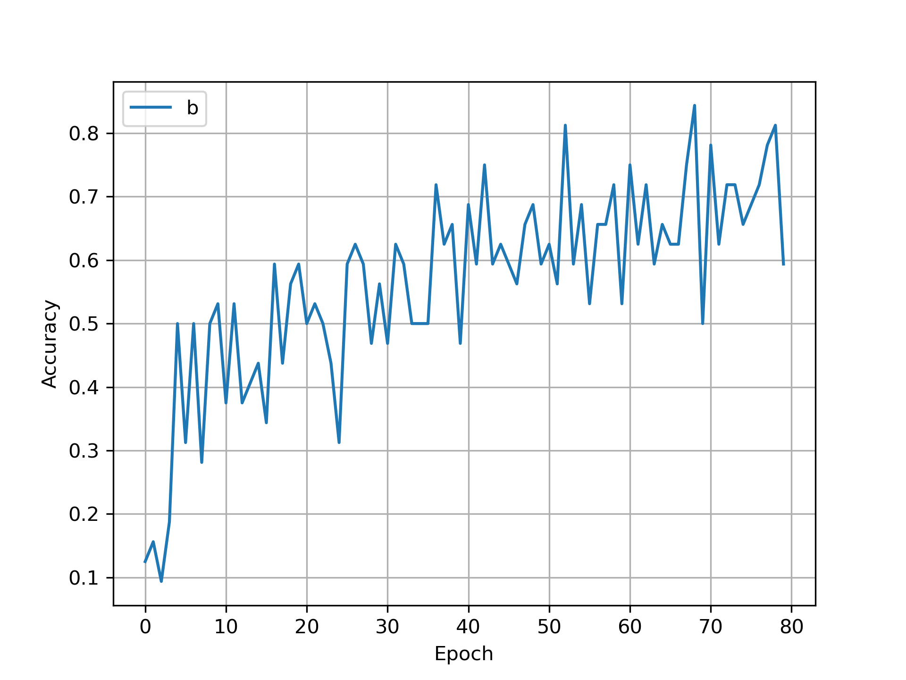
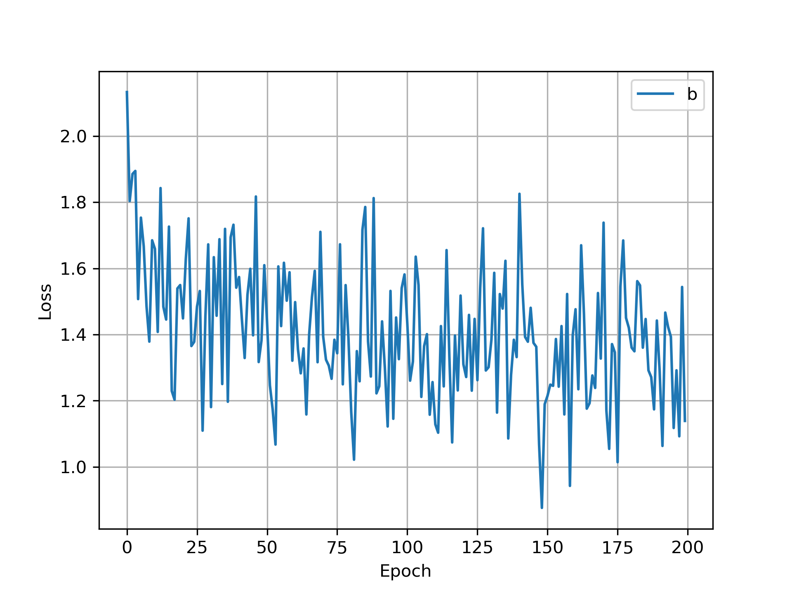
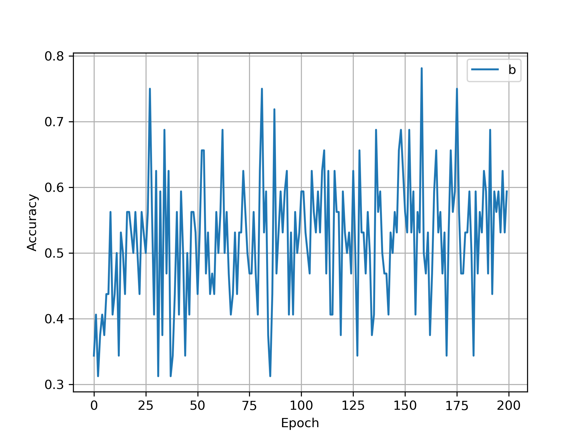

# 神经网络训练【CIFAR-10数据集】
笔者在本仓库中实现了基于CIFAR-10数据集的图像分类神经网络训练，主要包含两部分：
- 基于LeNet的图像（人工搭建神经网络，完成训练）
- 基于ResNet50的图像分类（使用迁移学习，完成训练）

该任务中组织代码的整体框架大概如下：

**定义数据集**（Dataset&&DataLoader） -> **定义神经网络** -> **确定训练设备device** -> **设定损失函数** -> **设定优化器** -> **进行网络训练并获取结果** -> **保存模型**

笔者在代码中均添加了非常详细的注释，十分适合新手入门学习

## CIFAR-10-LeNet
该部分的代码结构如下：
- Dataset.py（定义数据集，该代码中需要修改存放数据集的路径）
- Network.py（定义LeNet神经网络）
- Train.py（总的训练代码，实际运行文件）
- LoadModel.py（在Train.py保存了训练好的网络，该部分直接加载训练好的网络查看结果）
- model.pth （存储的LeNet网络全体结构，包含网络参数和网络结构）
- model_state_dict.pth （存储的LeNet网络参数，不包含网络结构）
- nohup.out （存储训练输出信息）
    - nohup是Linux和Unix系统中的一个命令，其作用是在终端退出时，让进程在后台继续运行,避免受终端关闭的影响
    (示例：`nohup python Train.py`)

训练集的损失函数曲线如下：



训练集的准确率函数曲线如下：



从折线图来看，整体的训练性能比较好，最终对测试集进行准确率测试时：

10000张图像的准确率为:0.6400

## CIFAR-10-ResNet
- Dataset.py（定义数据集，该代码中需要修改存放数据集的路径）
- Train.py（总的训练代码，在该部分加载了ResNet50预训练模型，并进行了训练）
- ResNet50_Verified.pth （微调ResNet50预训练模型后存储的网络）

ResNet50模型加载的相关代码如下：


```python
#加载神经网络
resnet50 = models.resnet50(weights = 'IMAGENET1K_V1')

#print(resnet50)  #通过该命令可以查看ResNet50的网络结构

#接下来需要冻结网络模型并修改全连接层以适配图像分类任务
num_features = resnet50.fc.in_features  #获取最后全连接层的输入以便于后续更改网络
for params in resnet50.parameters():
    params.requires_grad_(False) #将参数梯度训练设置为False，这些参数将不会被更新
#根据实际需求修改全连接层
resnet50.fc = nn.Linear(num_features, 10) #输出为10,修改该层后默认该层的requires_grad = true
resnet50.fc = nn.Sequential(nn.Linear(num_features, 10),
                            nn.LogSoftmax(dim=1)
                            )
#将网络传输给GPU
resnet50.to(device)
```

笔者在使用ResNet50微调网络实现图像分类任务时，从损失函数曲线和准确率曲线来看，虽然也能看出来曲线有些上升（或下降）的趋势，但是该网络的表现效果确实不咋地，训练时间长，效果也不好，笔者暂时找不出来原因是什么，留个坑之后填。

训练集的损失函数曲线如下：



训练集的准确率函数曲线如下：



---

两部分代码都是使用单机单卡进行训练,之后会考虑更新单机多卡的训练方式。

END

